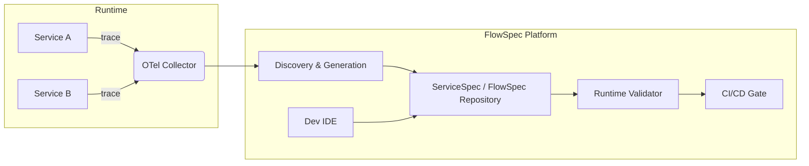

# ChoreoAtlas: Interaction Logic Governance Platform Whitepaper

Version: 1.1 (Proposal)  
Release Date: 2025-07-30  
Authors: Gemini & Partners

> Note: v1.1 extends the v1.0 draft with “Landscape & Differentiation”, “Tech Stack & OSS Strategy”, “Implementation Roadmap”, and an “Early PoC Blueprint”, suitable for external roadshows, fundraising, or internal budget proposals.

---

## Abstract

This whitepaper presents ChoreoAtlas, a platform-scale approach to governing service interaction logic in modern distributed systems. Today’s software teams frequently suffer from the “integration swamp” caused by implicit, shifting cross-service logic. Costs of development and testing surge and robustness suffers.

ChoreoAtlas addresses this at the root. It is not a single tool or a single language, but a comprehensive governance stack composed of dual specifications (ServiceSpec & FlowSpec), dual modes (Discover & Generate vs. Specify & Validate), and a complete toolchain.

Core idea: make invisible interaction logic explicit and structured as “Contracts-as-Code”, then realize “Spec-as-Audit”—validate feasibility and coherence at design-time instead of discovering issues late at runtime.

This document details the background, core principles, architecture, technical path, and value of ChoreoAtlas—offering a practical framework and playbook for teams aiming to improve efficiency and quality in distributed software.

---

## Table of Contents

1. Introduction  
2. Core Principles & Requirements  
3. System Architecture & Design  
4. Tech Stack, OSS Strategy & Compliance  
5. Landscape & Differentiation  
6. Implementation Roadmap  
7. Early PoC Blueprint  
8. Applications & Value  
9. Business Model & ROI  
10. Future Outlook  
11. Conclusion  
12. Appendix (Grammar Draft, References, Glossary)

---

## 1. Introduction

### 1.1 Background: Implicit Interaction Logic — Achilles’ Heel of Modern Software

Under microservices, business capabilities depend on collaboration across many services. While unit tests ensure correctness of individual services, cross-service interaction logic becomes the most fragile and chaotic area. It tends to “float” in three forms:
- Ambiguous natural language in requirement docs  
- “Tribal knowledge” in senior engineers’ heads  
- Hard-coded in frontends/backends and service call chains

This opacity causes 80%+ of integration issues and makes integration testing an expensive, slow swamp, dragging delivery speed and quality.

### 1.2 Vision: Make Interaction Logic Crystal Clear

We envision a new paradigm: interaction logic is precisely defined, versioned, and validated—just like code.

ChoreoAtlas aims to provide a single, visual, reusable, and verifiable source of truth for cross-service interaction logic.

---

## 2. Core Principles & Requirements

### 2.1 Contracts-as-Code (Specs mirror code behavior)
Specs must be a high-fidelity mirror of the code’s behavior. Not external documents, but embedded/adjacent to code (e.g., annotations). Precisely describe service behavior contracts—preconditions and postconditions—so developers can safely reuse them.

### 2.2 Spec-as-Audit (Validate feasibility at design-time)
Specs must be structured logic models, analyzable by tools/AI. Rigor enables static coherence and coupling checks before implementation—shifting issue discovery to design-time, which is far cheaper than runtime.

### 2.3 Non-Functional Requirements
- Security: no new vulnerabilities; masking hooks for sensitive data  
- Performance: runtime validators must keep overhead within acceptable bounds (e.g., <1%)  
- Observability: the platform’s own actions (validation, generation) are observable  
- Portability: core specs are language/framework-agnostic  
- Usability: syntax is intuitive with a gentle learning curve

---

## 3. System Architecture & Design

### 3.1 Macro View



> Decoupled architecture: the platform stores specs but does not control business code. The validator integrates into CI as a plug-in/gate.

### 3.2 Dual Specifications at a Glance

| Dimension | ServiceSpec | FlowSpec |
| --- | --- | --- |
| Granularity | Single service operation | Cross-service flows |
| Binding | Inline/annotations near code | Central YAML |
| Focus | Preconditions/Postconditions | Call ordering & data mapping |
| Validation | Static & runtime | Runtime trace matching |

### 3.3 ServiceSpec — Behavioral Contracts

Purpose: precisely describe the behavioral contract of each service interface.  
Location: embedded or adjacent to service code (e.g., annotations).  
Example (Java annotation pseudo):

```java
/**
 * @ServiceSpec
 * operationId: "createOrder"
 * description: "Create a new order (core operation)."
 * preconditions: {
 *   "User must be ACTIVE": "db.query('SELECT status FROM users WHERE id = ?', request.userId) == 'ACTIVE'"
 * }
 * postconditions: {
 *   "PENDING order inserted": "let order = db.find('orders', ...); order.status == 'PENDING'",
 *   "OrderCreated event emitted": "mq.emitted_event('orders_topic').name == 'OrderCreated'"
 * }
 */
@ServiceSpec(...)
public Order createOrder(CreateOrderRequest request) {
    // ... implementation ...
}
```

### 3.4 FlowSpec — Orchestration Layer

Purpose: describe the call ordering and data passing across services in a business flow.  
Location: centralized `.flowspec.yaml` file.  
Example:

```yaml
info:
  title: "User Signup & Welcome Email"
services:
  userService: { spec: "./userService/service.spec.yaml" }
  emailService: { spec: "./emailService/service.spec.yaml" }
flow:
  - step: "Create User"
    call: userService.createUser
    input: { ... }
    output: { newUserResponse: response.body }

  - step: "Send Welcome Email"
    call: emailService.sendEmail
    input:
      recipient: "${newUserResponse.email}"
```

---

## 4. Tech Stack, OSS Strategy & Compliance

| Layer | Primary | Alternatives | Notes |
| --- | --- | --- | --- |
| Language | TypeScript + Go | Rust | TS: FE & plugin ecosystem; Go: backend concurrency |
| Traces | OpenTelemetry | Zipkin | CNCF-compatible |
| Rules | drools-lite / JSONLogic | CEL | Sandbox-friendly, interpretable |
| Storage | Git + OCI Artifact | S3 | Spec versioning |
| License | Apache-2.0 | MIT | Community-friendly, avoid GPL contamination |
| Compliance | PII Masking | — | Pluggable masking hooks |

---

## 5. Landscape & Differentiation

| Project | Focus | Gaps | Our Moat |
| --- | --- | --- | --- |
| Pact | Consumer-driven contract testing | Point-to-point only | Bring cross-service flow semantics |
| Postman Flow | Visual API composition | Design tool, lacks validation | Bi-directional mapping & CI gate |
| Tracetest | Trace-based testing | Manual YAML | Auto “discover-generate” mode |
| — | — | — | Dual specs + dual modes → design-time coherence & runtime closed loop |

---

## 6. Implementation Roadmap

| Phase | Goal | Key Deliverables | ETA |
| --- | --- | --- | --- |
| 0 | Internal PoC | VSCode plugin + CLI validator | 2026 Q1 |
| 1 | MVP OSS | ServiceSpec DSL + trace alignment | 2026 Q2 |
| 2 | Enterprise | LDAP, RBAC, SLA specs | 2026 Q3 |
| 3 | Ecosystem | JetBrains plugin, GitHub App | 2026 Q4 |

---

## 7. Early PoC Blueprint

Scenario: E‑commerce “order → reserve inventory → ship” (Java + Spring Boot).  
Steps: (1) Instrument 3 services → OTel traces; (2) Handwrite 10 ServiceSpecs; (3) Handwrite 2 happy flows + 1 exception FlowSpec; (4) Write integration tests (RestAssured) → run validator.  
Success criteria: Trace–Spec match ≥ 90%; spec writing avg ≤ 2h/person; CI must fail on an intentional bug.

---

## 8. Applications & Value

- Faster onboarding: read specs to understand complex logic quickly  
- Safer large refactors: validate contracts before/after refactors  
- Higher test efficiency: static + automated validation reduces manual integration tests  
- AI enablement: give AI a “map” of system behavior for deeper codegen/diagnosis  
- Multi-tenant SaaS: tenant-level isolation → auto-generated differential regression suites (≈50% cost down)

---

## 9. Business Model & ROI

| Model | Revenue | ARPU | Notes |
| --- | --- | --- | --- |
| OSS + Cloud | SaaS subscription (validation compute) | $5–10/service/mo | Similar to Snyk |
| Enterprise | On‑prem license | $50k–200k/y | Finance, Healthcare |
| Marketplace | Plugin revenue share | 30% | Community extensions |

---

## 10. Future Outlook

- Performance specs: latency/throughput constraints as first‑class citizens  
- Auto remediation: AI not only reports failures but proposes patches  
- NL → Spec: write flows in natural language, get FlowSpec/ServiceSpec drafts  
- RAG‑powered Q&A: ask anything about system behavior based on the spec corpus

---

## 11. Conclusion

ChoreoAtlas, with dual specifications and dual modes, systematically addresses the opacity and volatility of cross‑service interaction logic. It shifts teams from reactive runtime firefighting to proactive design‑time prevention. By practicing “Contracts‑as‑Code” and “Spec‑as‑Audit”, ChoreoAtlas adds determinism to software delivery and improves both efficiency and quality.

> Not more documents—rather a cheaper design‑validation loop that turns integration failures into history.

---

## 12. Appendix

### 12.1 ServiceSpec Grammar (BNF, Draft)

```
ServiceSpec   ::= "operationId" ":" ID
                  "description" ":" STRING
                  "preconditions" ":" "{" AssertionMap "}"
                  "postconditions" ":" "{" AssertionMap "}"

AssertionMap  ::= Assertion ("," Assertion)*
Assertion     ::= STRING ":" Expr
Expr          ::= <CEL compatible expression>
```

### 12.2 References

1. Evans, Eric. Domain‑Driven Design. Addison‑Wesley, 2003.  
2. Meyer, Bertrand. Object‑Oriented Software Construction. Prentice Hall, 1997.  
3. CNCF. OpenTelemetry Specification.  
4. Fowler, Martin. Consumer‑Driven Contracts. martinfowler.com

### 12.3 Glossary

- ServiceSpec: spec adjacent to code, describing pre/postbehavior of single operations  
- FlowSpec: central spec describing cross‑service flows, ordering, and data mapping  
- Preconditions: logic that must hold before invocation  
- Postconditions: logic that must hold after success  
- Discovery Mode: generate specs by analyzing runtime traces  
- Validation Mode: verify implementations by comparing traces to specs

