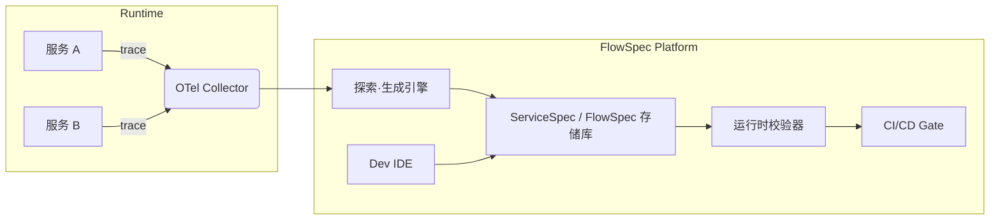

# ChoreoAtlas：交互逻辑治理平台白皮书

**版本**：1.1（提案）  
**发布日期**：2025-07-30  
**作者**：Gemini & 合作伙伴  

> ⚠️ 注：1.1 版在 1.0 草稿基础上补充了「竞争格局 & 差异化」「技术栈 & 开源策略」「实施路线图」「早期 PoC 设计」等板块，方便对外路演、拉投资或申请内部预算时使用。

---

## 摘要（Abstract）

本白皮书系统性地阐述了一种创新的、用于治理现代分布式系统中服务交互逻辑的平台级解决方案——FlowSpec。当前，软件行业普遍面临因服务间交互逻辑隐晦、多变而导致的“集成地狱”问题。开发与测试成本高昂，系统健壮性难以保证。

FlowSpec旨在从根本上解决这一挑战。它并非单一的工具或语言，而是一个由**双规约体系（`ServiceSpec` & `FlowSpec`）**、**双模治理平台（探索与生成 & 规约与校验）**和**完整工具链**共同构成的综合治理平台。

其核心思想是，将原本不可见的、隐含在代码内部的交互逻辑，通过**“契约即代码”**的方式进行显式化、结构化的描述；并以此为基础，实现**“规约即可复核”**，在设计阶段便能对逻辑的可实现性进行分析与验证。

本白皮书将详细介绍FlowSpec的需求背景、核心原则、系统架构、实现路径及应用价值，为期望从根本上提升分布式系统开发效率和质量的团队，提供一套完整的、可落地的理论框架和行动指南。

---

## 目录（TOC）

1.  引言 (Introduction)
2.  核心原则与需求 (Core Principles & Requirements)
3.  系统架构与设计 (System Architecture & Design)
4.  技术栈、开源策略与合规性 (Tech Stack & OSS Strategy)
5.  竞争格局与差异化 (Landscape & Differentiation)
6.  实施路线图 (Roadmap)
7.  早期 PoC 方案 (PoC Blueprint)
8.  应用场景与价值 (Applications & Value)
9.  商业模式与收益测算 (Biz Model & ROI)
10. 未来展望 (Future Outlook)
11. 结论 (Conclusion)
12. 附录（语法草案、参考文献、术语表）

---

## 1. 引言 (Introduction)

### 1.1 问题背景：隐晦的交互逻辑——现代软件开发的“阿喀琉斯之踵”

在微服务架构下，业务功能的实现依赖于多个分布式服务的协同合作。单个服务的正确性可以通过单元测试来保证，但服务之间的**交互逻辑**，却成为了系统最脆弱、最混乱的环节。这些交互逻辑，往往以三种形态“漂浮”于团队之中：
* 存在于需求文档的自然语言描述中，充满了歧义。
* 存在于资深开发者的“部落知识”中，难以传承。
* 硬编码在前后端或服务间的调用代码中，难以阅读和维护。

这种“隐晦”的交互逻辑，直接导致了超过80%的集成问题，使得集成测试成为成本高昂、效率低下的“沼泽地”，严重拖慢了软件交付的速度和质量。

### 1.2 我们的愿景：让交互逻辑如水晶般透明

我们设想一个全新的开发范式：系统的交互逻辑不再是隐晦的、不可靠的，而是像代码一样，被精确地定义、被严格地版本控制、被自动化地验证。

FlowSpec平台正是为实现这一愿景而生。它的目标是：
**为分布式系统的交互逻辑，提供一个统一的、可视化的、可复用、可验证的“唯一真相来源”。**

---

## 2. 核心原则与需求

### 2.1 核心一：规约是“代码逻辑的准确体现”（契约即代码）
规约必须是其所描述代码的“高保真镜像”。它并非一份外部文档，而是通过注解等形式与代码强绑定，成为代码自身的一部分。它精确描述服务对外承诺的**行为契约**，包括入口要求（前置条件）和出口要求（后置条件），让任何开发者都能快速理解其能力和承诺，从而安全复用。

### 2.2 核心二：通过规约“复核逻辑要求的可实现性”（规约即可复核）
规约必须是一份结构化的“逻辑模型”，而不仅是静态的文本。其语法必须足够严谨，以支持自动化工具或AI对其进行分析和推理。这使得在编写具体实现代码之前，就能对设计进行**静态的逻辑自洽性**和**流程耦合性**的验证，将发现错误的阶段，从成本高昂的“运行时”，前移到成本极低的“设计时”。

### 2.3 非功能性需求补充
* **安全性 (Security)**: 规约和校验器本身不能引入新的安全漏洞，支持对敏感数据的脱敏处理。
* **性能 (Performance)**: 运行时校验器对业务系统的性能影响必须在可接受的范围内（例如 < 1%）。
* **可观测性 (Observability)**: 平台自身的所有行为（校验、生成等）都应是可观测的。
* **可移植性 (Portability)**: 核心规约应与具体语言和框架无关，具备高度可移植性。
* **易学性 (Usability)**: 规约的语法设计应符合直觉，学习曲线平缓。

---

## 3. 系统架构与设计

### 3.1 宏观视图



> ☝️ **说明**：上下游解耦，平台仅存储规约，不直接控制业务代码；校验器以插件方式嵌入 CI。

### 3.2 双规约语法要点

| 维度 | ServiceSpec | FlowSpec |
| :--- | :--- | :--- |
| **粒度** | 单服务接口 | 跨服务流程 |
| **绑定方式** | 注解 / DSL inline | 独立 YAML |
| **关注点** | 前置/后置条件 | 调用顺序 & 数据映射 |
| **校验手段** | 静态 & 动态 | 动态轨迹比对 |

### 3.3 `ServiceSpec`: 行为契约的核心

  * **目的**: 精确描述**单个服务**中，每个对外接口的**行为契约**。
  * **位置**: 以**注解**的形式，与实现该接口的服务代码**并置**。
  * **语法示例 (`@ServiceSpec` in Java)**:
    ```java
    /**
     * @ServiceSpec
     * operationId: "createOrder"
     * description: "创建一个新订单。这是系统核心操作之一。"
     * preconditions: {
     * "用户状态必须为'ACTIVE'": "db.query('SELECT status FROM users WHERE id = ?', request.userId) == 'ACTIVE'"
     * }
     * postconditions: {
     * "数据库中必须创建一条状态为'PENDING'的新订单": "let order = db.find('orders', ...); order.status == 'PENDING'",
     * "必须发布'OrderCreated'事件": "mq.emitted_event('orders_topic').name == 'OrderCreated'"
     * }
     */
    @ServiceSpec(...)
    public Order createOrder(CreateOrderRequest request) {
        // ... implementation code ...
    }
    ```

### 3.4 `FlowSpec`: 业务流程的编排层

  * **目的**: 作为更高阶的规约，它只负责描述一个完整的业务流程中，不同服务接口之间的**调用顺序**和**数据传递关系**。
  * **位置**: 作为**独立的、中心化的 `.flowspec.yaml` 文件**存在。
  * **语法示例 (`.flowspec.yaml`)**:
    ```yaml
    info:
      title: "用户注册并发送欢迎邮件"
    services:
      userService: { spec: "./userService/service.spec.yaml" }
      emailService: { spec: "./emailService/service.spec.yaml" }
    flow:
      - step: "创建新用户"
        call: userService.createUser
        input: { ... }
        output: { newUserResponse: response.body }

      - step: "发送欢迎邮件"
        call: emailService.sendEmail
        input:
          recipient: "${newUserResponse.email}"
    ```

-----

## 4. 技术栈、开源策略与合规性

| 层次 | 技术选型 | 备选 | 备注 |
| :--- | :--- | :--- | :--- |
| **语言** | TypeScript + Go | Rust | TS：前端 & 插件生态；Go：后端高并发 |
| **Trace 采集** | OpenTelemetry | Zipkin | 兼容 CNCF 标准 |
| **规则引擎** | drools-lite / JSONLogic | CEL | 选型原则：易沙盒、易解释 |
| **存储** | Git + OCI Artifact | S3 | 规约文件版本化 |
| **开源协议** | Apache-2.0 | MIT | 鼓励社区贡献、避免 GPL 污染 |
| **数据合规** | PII Masking | — | 提供可插拔脱敏 hook |

-----

## 5. 竞争格局与差异化

| 公司/项目 | 侧重 | 差距 | 我们的壁垒 |
| :--- | :--- | :--- | :--- |
| **Pact** | 消费者驱动契约测试 | 仅点对点接口 | 引入「跨服务流程」语义 |
| **Postman Flow** | API 可视编排 | 设计工具，缺乏校验 | 双向映射 & CI Gate |
| **Tracetest** | 基于 Trace 测试 | 手工写 YAML | 自动“探索-生成”模式 |
| **—** | **—** | **—** | **双规约 + 双模式** 👉 设计时自洽、运行时闭环 |

-----

## 6. 实施路线图 (Roadmap)

| 阶段 | 目标 | 关键交付物 | 时间 |
| :--- | :--- | :--- | :--- |
| **Phase 0** | 内部 PoC | VSCode 插件 + CLI 验证器 | 2026 Q1 |
| **Phase 1** | MVP 开源 | ServiceSpec DSL + Trace 对齐 | 2026 Q2 |
| **Phase 2** | 企业特性 | LDAP、RBAC、SLA 规约 | 2026 Q3 |
| **Phase 3** | 生态扩张 | JetBrains 插件、GitHub App | 2026 Q4 |

-----

## 7. 早期 PoC 方案 (PoC Blueprint)

1.  **选型场景**：电商“下单-扣库存-发货” 微服务 (Java + Spring Boot)。
2.  **PoC 步骤** ① 对 3 个服务插桩 → 输出 OTel Trace  
    ② 手写 ServiceSpec（10 个接口）  
    ③ 手写 FlowSpec（2 条主流程、1 条异常流）  
    ④ 编写集成测试 (RestAssured) → 运行校验器
3.  **成败指标** • Trace-Spec 匹配率 ≥ 90%  
    • 团队编写规约平均耗时 ≤ 2h/人  
    • 当引入一个刻意 bug 时 CI 必须失败

-----

## 8. 应用场景与价值

  * **加速新员工融入**: 通过阅读规约，快速理解复杂系统的核心逻辑。
  * **保障大规模重构**: 在重构前后，通过规约校验，确保外部行为契约不被破坏。
  * **提升测试效率**: 大部分逻辑验证可通过规约的静态分析和自动化校验完成，极大减少手动编写和维护集成测试用例的工作量。
  * **赋能AI辅助开发**: 为AI提供理解系统行为的“地图”，使其能够进行更深层次的代码生成、问题诊断和修复建议。
  * **多租户 SaaS**: 租户级逻辑隔离通过 ServiceSpec 自动生成差异化回归用例，成本下降 50%。

-----

## 9. 商业模式与收益测算

| 模式 | 收益来源 | 预估 ARPU | 备注 |
| :--- | :--- | :--- | :--- |
| **OSS+Cloud** | SaaS 订阅（校验算力） | $5-10/服务/月 | 类似 Snyk 定价 |
| **Enterprise** | 私有化部署许可 | $50k-200k/年 | 金融、医疗 |
| **Marketplace** | 插件分成 | 30% | 社区共享 |

-----

## 10. 未来展望

  * **性能规约**：在规约中加入对延迟、吞吐量等非功能性需求的描述与校验。
  * **序列化自动修复**：当校验失败时，AI不仅报告错误，更能提供精准的修复建议或代码补丁。
  * **自然语言转规约**：允许开发者用自然语言描述业务流程，AI自动生成FlowSpec和ServiceSpec草稿。
  * **RAG-Powered 问答**：基于整个项目的规约库，提供一个智能问答机器人，回答关于系统行为的任何问题。

-----

## 11. 结论

FlowSpec通过其创新的**双规约体系**和**双模治理平台**，系统性地解决了分布式系统中交互逻辑隐晦、易变的核心痛点。它将开发范式从“运行时救火”的被动模式，转变为“设计时防火”的主动模式。通过将“契约即代码”和“规约即可复核”两大原则付诸实践，FlowSpec不仅仅是一门语言或一个工具，它是一个能够为软件开发带来确定性、提升工程效率、保障系统质量的全新**交互逻辑治理平台**。

> FlowSpec 不是另一套「写文档的负担」，而是把隐藏成本前置到最小代价的设计-校验循环里，将每一次集成失败都变成历史。

-----

## 12. 附录

### 12.1 ServiceSpec 语法 BNF（草案）

```
ServiceSpec   ::= "operationId" ":" ID
                  "description" ":" STRING
                  "preconditions" ":" "{" AssertionMap "}"
                  "postconditions" ":" "{" AssertionMap "}"

AssertionMap  ::= Assertion ("," Assertion)*
Assertion     ::= STRING ":" Expr
Expr          ::= <CEL compatible expression>
```

### 12.2 参考文献

1.  Evans, Eric. *Domain-Driven Design: Tackling Complexity in the Heart of Software*. Addison-Wesley, 2003.
2.  Meyer, Bertrand. *Object-Oriented Software Construction*. Prentice Hall, 1997. (For Design by Contract)
3.  CNCF. *OpenTelemetry Specification*.
4.  Fowler, Martin. "ConsumerDrivenContracts". martinfowler.com.

### 12.3 术语表

  * **ServiceSpec (服务规约)**: 一种与代码并置的规约，用于描述单个服务接口的前置与后置行为契约。
  * **FlowSpec (流程规约)**: 一种中心化的规约，用于描述跨多个服务的业务流程、调用顺序和数据映射。
  * **前置条件 (Pre-conditions)**: 在调用一个服务接口前，必须得到满足的逻辑条件。
  * **后置条件 (Post-conditions)**: 在一个服务接口成功执行后，必须被满足的逻辑条件或系统状态。
  * **探索模式 (Discovery Mode)**: FlowSpec平台的一种工作模式，通过分析系统运行时轨迹，自动生成规约。
  * **校验模式 (Validation Mode)**: FlowSpec平台的一种工作模式，通过比对运行时轨迹与既定规约，来验证代码实现的正确性。

